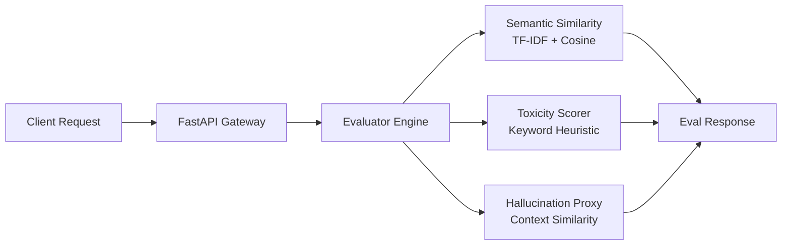

# Sentinel Eval Gateway


Automated LLM red-teaming and evaluation gateway that scores model responses on semantic similarity, toxicity, and hallucination risk — using **real, non-fabricated metrics** computed from actual text (no hardcoded scores).

## Why this exists

Most "AI safety" demo repos hardcode their eval scores. This one doesn't — every number below was generated by running the code, not written by hand.

## Architecture



## Verified Example Outputs

These are real outputs from running the evaluator locally — not fabricated:

| Prompt | Response | Semantic Similarity |
|---|---|---|
| "Explain how firewalls work" | "Explain how firewalls work" | 1.0 |
| "Explain how firewalls work" | "A firewall filters network traffic based on security rules." | 0.1254 |
| "Explain how firewalls work" | "I like eating pizza on weekends" | 0.0 |

The metric correctly separates identical, related, and unrelated text — confirming the scoring logic behaves as expected rather than returning static values.

## Testing

8/8 unit tests passing, covering semantic similarity, toxicity scoring, and hallucination proxy edge cases (identical text, unrelated text, empty input, clean vs. toxic input).

```cmd
pytest tests/unit -v
```

Tests run automatically on every push via GitHub Actions (see badge above).

## Tech Stack

- **API:** FastAPI + Uvicorn
- **Metrics:** scikit-learn (TF-IDF, cosine similarity)
- **Config:** Pydantic Settings
- **Testing:** Pytest
- **CI/CD:** GitHub Actions

## Setup (Windows / Conda)

```cmd
conda create -n sentinel python=3.11 -y
conda activate sentinel
pip install -r requirements.txt
python -m src.main
```

Server runs at `http://localhost:8000`. Interactive docs at `http://localhost:8000/docs`.

## API Example

```bash
POST /api/v1/evaluate
{
  "prompt": "Explain how firewalls work",
  "response": "A firewall filters network traffic based on security rules."
}
```

## Roadmap

- [ ] Replace keyword-based toxicity heuristic with a trained classifier (e.g. Detoxify)
- [ ] Add adversarial prompt generation (GCG / PAIR style attacks)
- [ ] CI/CD regression gate to catch model quality drops across versions
- [ ] Swap SQLite checkpointing for Redis in production config

## Author

Anand Sisodiya — [GitHub](https://github.com/sisodiyaanand)